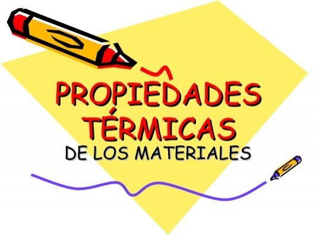
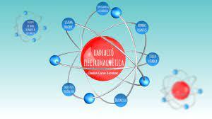

# Tema 2

## Propietats dels materials
* Propietats dels materials
    1. Mecàniques
        - [ ] Duresa
        - [ ] Tenacitat
        - [ x ] Fragilitat
        - [ ] Elasticitat
        - [ x ] Plasticitat
        - [ ] Permeabilitat
        - [ ] Mal·leabilitat
        - [ ] Ductilitat
        >Nota: Aquestes son les més importants, però hi ha llibres que en proposen més.
    2. Tèrmiques

        
        
    3. Ambientals o ecològiques
    
    4. Electromagnètiques
   
    5. Fisicoquímiques
    6. Òptiques